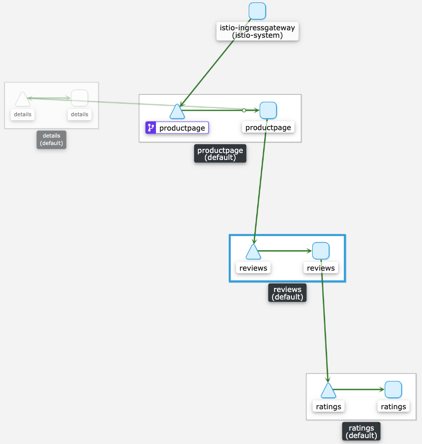

# istio-upgrades

## What's the point of this repository?

To help simulate the upgrade from [Istio](istio.io) `1.3` -> `1.4` -> `1.6`

## What's in this respository?

Resources from the `istio` repoistory (_including resources from different versions_) have been added to help reduce bandwidth requirements. The bookinfo sample is also included to help simulate an application.

## How do you execute the upgrade strategy?

### Prerequisites

1. [Docker Desktop](https://docs.docker.com/desktop/)
  a. you'll need to allow at least 8Gb memory
2. [kind](https://kind.sigs.k8s.io/docs/user/quick-start/)
3. [kubectl](https://kubernetes.io/docs/tasks/tools/install-kubectl/)
4. [Helm v2](https://github.com/helm/helm/releases/tag/v2.17.0)

### Steps

1. Initial setup:

```
$ make setup
```
#### What does this do?

- Creates a kind cluster and installs kubernetes `1.5.11`
- Install `Istio` version `1.3.3` using `Helm v2`
- Install the `bookinfo` sample application

This should allow you to access the `bookinfo` sample project from your browser - [bookinfo](http://localhost/productpage)

2. Upgrade `Istio` to `1.4.10`

```sh
$ make upgrade-istio-to-1.4.10
```

#### What does this do?

- Performs a Helm upgrade to the newer `istio-init` chart
- Performs a Helm upgrade to the newer `istio` chart


3. Upgrade `Istio` to `1.6.13`

```sh
$ make upgrade-istio-to-1.6.13
```

#### What does this do?

- Patch the `istio-galley` deployment to disable validation.
- Delete the `istio-galley` validating webhook should one exist.
- Download the versiob `1.6.13` of the `istioctl` binary from GitHub.
- Initialise the istio operator using `istioctl`.
- Create a default instance of an Istio Operator.
- Label the default namespace with `istio.io/rev=1-6-13` to point to the latest `1.6.13` revision and remove the `istio-injection` label.
- Scale down the deployments managed by Helm from the previous release (*At this point we need to prevent the `istio-ingressgateway` from being scaled down as we use this as our ingress*").
- Perform a restart of all deployments in the `default` namespace.
- Patch the `istio-ingressgateway`, replace the `nodePort` values for the HTTP & HTTPS port mappings (*this ensures we can still access the sample app due to the fixed port mapping kind cluster configuration*).


## How do I view the sample app?

```
curl http://localhost/productpage
```

or Navigate to http://localhost/productpage in your browser.

## How to I view a Graph of the traffic flow?

```
$ ./istio/1.6.13/istioctl dashboard kiali
```
**E.g**

